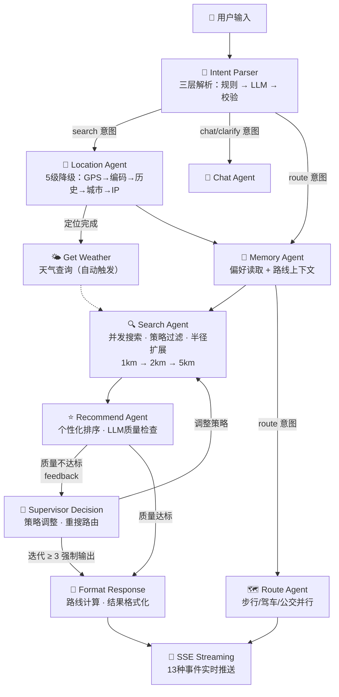
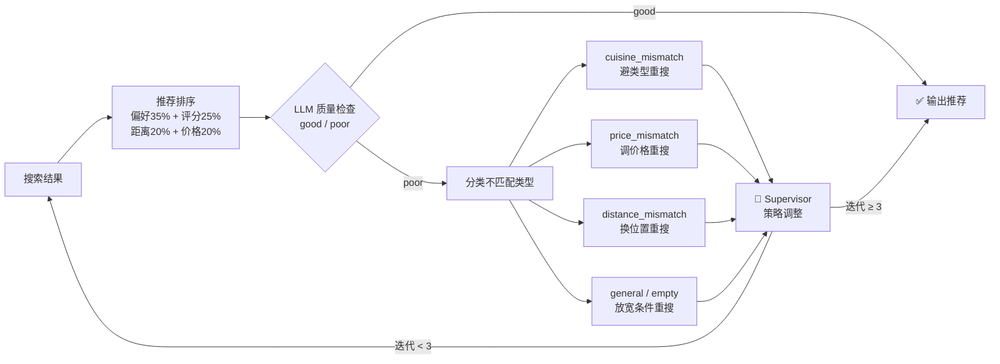
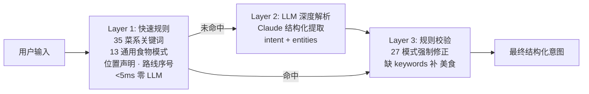
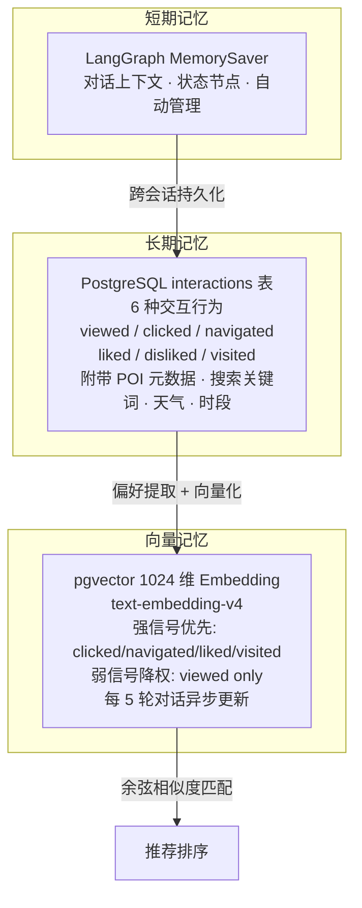
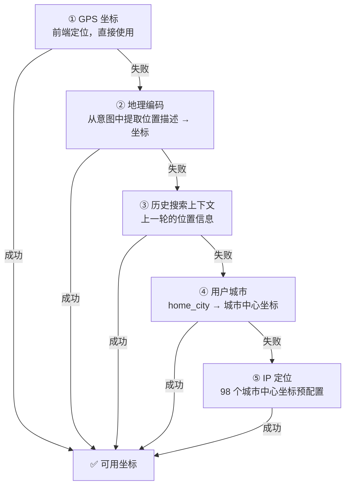
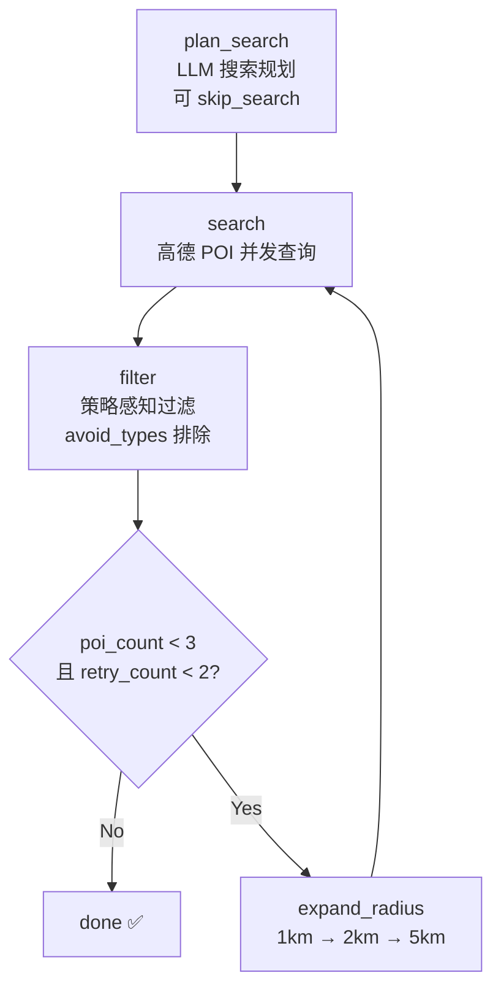

<div align="center">


<br/>

**基于 LangGraph Multi-Agent 的智能餐厅推荐系统**

6 个专业 Agent 协作 · 质量门控闭环 · 三层意图解析 · 偏好向量学习 · 实时 SSE 推送

<br/>


<br/>

<a href="https://github.com/ywx914705/AeroSavor/stargazers"></a>
<a href="https://github.com/ywx914705/AeroSavor/fork"></a>

</div>

---

> 💬 *"找个适合约会的安静日料，人均 200 以内"* → 6 个 Agent 协同推理 → 质量校验通过 → 5 家精准推荐 + 一键导航

AeroSavor 不是关键词匹配工具，而是一个真正理解自然语言的 AI 美食顾问。6 个专业 Agent 以 Supervisor 模式编排，通过高德地图 API 获取实时餐厅数据，结合 pgvector 用户偏好向量实现个性化排序。系统内置质量反馈循环——推荐不达标时自动触发策略调整和重搜，同时每个 Agent 都有规则引擎兜底，LLM 故障时系统不会崩溃。

---

## ✨ 核心特性

<table>
<tr>
<td width="50%">

### 🗣️ 自然语言搜索

不用填筛选条件，直接说出你想吃的。三层意图解析引擎自动提取关键词、位置、价位、偏好，转化为精准搜索策略。

支持模糊表达：`"市中心好吃的"`、`"人均150以内的川菜"`、`"找个安静适合聊天的地方"`

</td>
<td width="50%">

### 🤖 Multi-Agent 协作

6 个 Agent 以 Supervisor 模式编排：意图解析 → 位置确认 → 偏好读取 → 并发搜索 → 个性化排序 → 路线规划。Agent 之间支持 5 种类型消息直接通信，质量不达标时自动触发策略调整和重搜。

</td>
</tr>
<tr>
<td width="50%">

### 🧠 偏好学习

三层记忆系统：短期对话上下文（MemorySaver）、长期交互行为记录（PostgreSQL）、pgvector 偏好向量（1024 维）。每 5 轮对话自动更新偏好 Embedding，区分强信号（点击/导航/收藏/打卡）和弱信号（仅浏览），推荐越用越准。

</td>
<td width="50%">

### 📡 实时真实数据

所有餐厅信息来自高德地图实时 API——评分、价格、距离、营业时间、人均消费，100% 真实。Redis 缓存高频查询结果，减少重复 API 调用。

</td>
</tr>
<tr>
<td width="50%">

### 🗺️ 智能路线规划

步行、驾车、公交三种出行方式并行计算，自动返回耗时、距离、费用。支持从推荐列表直接跳转高德地图导航。

</td>
<td width="50%">

### 💬 多轮深度对话

SSE 流式推送 13 种事件类型，前端实时展示 Agent 思考过程。支持追问、对比、换推荐、调整条件。跨轮次搜索上下文持久化，多轮对话不丢失。

</td>
</tr>
</table>

---

## 🏗️ 系统架构



### 质量反馈闭环

系统的核心创新点是 **质量门控迭代**——不是搜一次就输出，而是经过质量评估后决定是否重搜：



### Agent 通信协议

5 种消息类型，通过 `Annotated[list, add]` 状态字段自动追加，保留完整协作历史：

| 消息类型 | 方向 | 场景 |
|:---------|:-----|:-----|
| `feedback` | Agent → Supervisor | 搜索质量反馈：空结果 / 低质量 / 菜系不符 |
| `request` | Agent → Agent | RecommendAgent 委派 SearchAgent 换关键词重搜 |
| `response` | Agent → Agent | SearchAgent 确认收到委派并报告执行情况 |
| `result` | Agent → Supervisor | 正常完成报告 |
| `error` | Agent → Supervisor | 异常上报 |

---

## 🔬 技术深度

### 1. 三层意图解析引擎

Intent Parser 采用 **三层解析策略**，兼顾速度和准确性：



1. **快速规则层**（零 LLM 调用）：正则匹配 35 个菜系关键词 + 13 个通用食物模式 + 位置声明 + 路线序号（`"第几家"`）+ 问候语等确定性场景，平均 <5ms
2. **LLM 深度解析层**：Claude 提取结构化意图（search/chat/route/compare/clarify）+ 实体（keywords/location_hint/price_range/chat_type）
3. **规则校验层**：LLM 输出后置校验——27 个规则模式强制修正（如 `你好` 被误判为 search，规则层强制修正为 chat）；LLM 提取了 location 但没 keywords 时，默认补 `美食`

三者串联，规则优先、LLM 兜底、规则再校验，确保意图识别准确率最大化。

### 2. 个性化排序算法

```python
# 成熟用户
score = amap_rating × 0.25 + preference_match × 0.35 + distance × 0.20 + price × 0.20

# 冷启动（无偏好数据的新用户）
score = amap_rating × 0.50 + distance × 0.30 + price × 0.20
```

`preference_match` 由两部分组成：
- **向量余弦相似度**：用户偏好 Embedding（1024 维）与 POI 文本的余弦距离
- **显式偏好调整**：偏好菜系 +0.2 加分，反感菜系 -0.3 惩罚（作用于 preference_score 分量）

距离评分采用 **阶梯函数**，针对中国城市用餐场景优化：

| 距离 | 得分 | 设计意图 |
|:-----|:-----|:---------|
| ≤ 500m | 1.0 | 步行可达，最佳体验 |
| ≤ 1km | 0.8 | 舒适步行距离 |
| ≤ 2km | 0.6 | 需要交通工具 |
| ≤ 3km | 0.4 | 较远 |
| > 3km | 0.2 | 降权 |

### 3. 三层记忆系统



偏好更新流程：
1. 查询用户近期 30 条交互，优先取强信号记录（clicked/navigated/liked/visited）
2. 若无强信号，降级到弱信号（仅浏览），并标注 `弱信号参考`
3. LLM 汇总交互历史为自然语言偏好描述
4. 结构化提取：偏好菜系 / 反感菜系 / 价位区间 / 偏好特征
5. 向量化并 upsert 到 `user_preference_embeddings` 表

### 4. LLM + 规则双保险

每个 Agent 都内置独立的规则降级路径，LLM 不可用时系统以降级模式继续运行：

| Agent | LLM 正常 | LLM 故障降级 |
|:------|:---------|:-------------|
| Intent Parser | Claude 意图解析 | 35+13 关键词正则 + 27 规则模式 + 98 城市名匹配 |
| Location Agent | LLM 模糊位置推理 | GPS → 地理编码 → 历史位置 → 城市名 → IP 降级链 |
| Search Agent | LLM 搜索规划 | 关键词启发式扩展 + 半径自动扩大 (1km→2km→5km) |
| Recommend Agent | LLM 推荐理由生成 + 质量检查 | 规则化推荐文案 + 评分排序 |
| Chat Agent | Claude 自由对话 | 5 类硬编码回复（问候/身份/功能/社交/通用） |
| Supervisor | LLM 动态路由 | 规则路由（iteration < limit → 重搜） |

**系统永远不会因为 LLM 故障而崩溃。**

### 5. 弹性 Claude 客户端

自行实现的零依赖 Claude 客户端（基于 raw httpx）：

- **双认证头兼容**：同时支持 `Authorization: Bearer`（代理）和 `x-api-key`（官方 API）
- **指数退避重试**：429 / 5xx 自动重试，退避间隔 1s → 2s → 4s，最多 3 次
- **流式双格式解析**：同时兼容 Anthropic 原生格式和 OpenAI 兼容格式（代理场景）
- **URL 智能归一化**：自动剥离尾部 `/v1`、`/v1/messages`、`/messages`，兼容各种代理配置
- **可选 LangSmith 集成**：环境变量开启后自动上报调用链路、延迟、prompt/response

### 6. 位置推理引擎

5 级降级链，确保任何情况下都能解析出可用坐标：



对于模糊描述（`"市中心"`），LLM 会推理出具体地标（成都 → 春熙路，北京 → 王府井）。已包含精确地址描述（含"路/街/号/栋/楼/层/室/区"）时自动跳过 LLM 推理。

### 7. 并发搜索与自动扩半径

Search Agent 内部是一个独立的子图：



- LLM 搜索规划可决定 `skip_search`（当前结果已足够）
- 支持策略感知过滤：从 Supervisor 反馈中获取 `avoid_types`，过滤掉不想要的餐厅类型
- 最低评分阈值随重试次数递减，平衡质量和数量

### 8. 双后端限流

针对 `/api/chat` 和 `/api/chat/stream` 等高开销端点：

- **Redis 主后端**：`INCR + EXPIRE` 原子操作，3600 秒固定窗口，默认 100 次/小时
- **内存自动降级**：Redis 不可用时无缝切换到内存滑动窗口（deque 实现），带异步锁保护
- 定期清理过期 key（最大 10,000 key，每 300 秒清理），防止内存泄漏
- 标准 `X-RateLimit-Limit`、`X-RateLimit-Used`、`Retry-After` 响应头
- 客户端标识：Bearer token 用户 > x-forwarded-for IP > client.host IP

### 9. 实时 SSE 事件总线

`asyncio.Queue` per-session 事件总线，13 种事件类型：

| 事件 | 前端视觉效果 |
|:-----|:-------------|
| `agent_start` | Agent 卡片滑入 + 脉冲动画 + 实时计时器 |
| `agent_done` | 完成闪烁 + 耗时显示 + 时间线变绿 |
| `supervisor_decision` | 决策卡片 + 路由方向标签 |
| `agent_message` | Agent 间消息传递可视化 |
| `delegation` | Agent 间委派连线 + 任务描述 |
| `quality_retry` | 紫色策略调整卡片 + 新策略描述 |
| `collaboration` | Agent 协作事件高亮 |
| `recommendations` | 推荐卡片瀑布流 |
| `route_info` | 路线面板（步行/驾车/公交） |
| `response` | 流式文字打字机效果 |
| `done` | 对话结束标记 |
| `heartbeat` | 连接保活（30 秒无事件触发） |
| `error` | 错误信息 |

自动清理机制：stream 结束后 queue 自动移除，防止内存泄漏。

---

## 🛠️ 技术栈

| 层级 | 技术 | 说明 |
|:-----|:-----|:-----|
| **前端** | React 18 · TypeScript 5 · Tailwind CSS 3 · Vite 5 | 响应式三栏布局，SSE 实时推送，Zustand 状态管理，Leaflet 地图 |
| **后端** | Python 3.11 · FastAPI · LangGraph | 异步 API，分层 Multi-Agent 图编排 |
| **推理** | Claude (Anthropic) · 自研 httpx 客户端 | 意图解析、搜索规划、质量评估、推荐生成 |
| **向量化** | DashScope text-embedding-v4 | 1024 维偏好 Embedding，余弦相似度匹配 |
| **数据库** | PostgreSQL 16 · pgvector | 6 表结构 + 向量检索，5 次 Alembic 迁移 |
| **缓存** | Redis 7 | 高频 Amap 查询缓存 + 固定窗口限流 |
| **数据源** | 高德地图 Web 服务 API | POI 搜索 · 路线规划 · 地理编码 · 天气 · 逆地理编码 |
| **监控** | Prometheus · Grafana | 搜索延迟 · LLM 调用量 · 用户反馈 · 限流指标 |
| **部署** | Docker Compose · Nginx | 一键部署 6 服务，SSE 专用代理配置，健康检查 |

---

## 🚀 快速开始

两种方式任选：**Docker 一键部署**（推荐）或 **本地开发**。

### Docker 一键部署

```bash
# 克隆项目
git clone https://github.com/ywx914705/AeroSavor.git
cd AeroSavor

# 配置环境变量（填入 3 个 API Key）
cp .env.example .env
vim .env

# 一键启动全部服务
docker-compose up -d

# 初始化数据库（首次运行）
docker-compose exec backend alembic upgrade head
```

打开 **http://localhost:3000** 即可对话。

> 包含 6 个服务：PostgreSQL (pgvector) · Redis · 后端 · 前端 (Nginx) · Prometheus · Grafana

<details>
<summary><b>📦 各服务端口</b></summary>

| 服务 | 端口 | 说明 |
|:-----|:-----|:-----|
| 前端 | http://localhost:3000 | Nginx 反向代理，SSE 专用配置 |
| 后端 | http://localhost:8000 | FastAPI（Nginx 已代理，一般不直接访问） |
| PostgreSQL | localhost:5433 | 映射到 5433 避免本地端口冲突 |
| Redis | localhost:6379 | 256MB 内存限制，LRU 淘汰 |
| Prometheus | http://localhost:9090 | 抓取后端 `/metrics` |
| Grafana | http://localhost:3001 | admin / admin |

</details>

<details>
<summary><b>🔧 Docker 常用命令</b></summary>

```bash
docker-compose ps                  # 运行状态
docker-compose logs -f backend     # 后端日志
docker-compose restart backend     # 重启单个服务
docker-compose down                # 停止全部
docker-compose down -v             # 停止并清除数据卷（⚠️ 删除数据库数据）
docker-compose up -d --build       # 代码更新后重新构建
```

</details>

---

### 本地开发

```bash
# 克隆项目
git clone https://github.com/ywx914705/AeroSavor.git
cd AeroSavor

# Python 依赖
pip install poetry && poetry install

# 前端依赖
cd frontend && npm install && cd ..

# 环境变量
cp .env.example .env
# 编辑 .env，填入 3 个 API Key：
#   AMAP_API_KEY      — https://lbs.amap.com/dev/key/app（Web 服务类型）
#   ANTHROPIC_API_KEY  — https://console.anthropic.com/
#   OPENAI_API_KEY     — https://dashscope.console.aliyun.com/（兼容 OpenAI API）

# 启动数据库
docker-compose up -d postgres redis

# 验证高德 Key
poetry run python scripts/test_amap_api.py

# 数据库迁移
poetry run alembic upgrade head

# 启动后端
poetry run uvicorn src.main:app --reload --port 8000

# 启动前端（新终端）
cd frontend && npm run dev
```

打开 **http://localhost:3000** 即可对话。

---

## 📁 项目结构

```
AeroSavor/
├── src/                              # Python 后端
│   ├── main.py                       # FastAPI 入口，路由注册，CORS，限流中间件
│   ├── core/                         # 基础设施层
│   │   ├── config.py                 # Pydantic Settings，22 个环境变量自动加载
│   │   ├── database.py               # SQLAlchemy 异步引擎（asyncpg，10 连接池）
│   │   ├── llm.py                    # 自研 Claude 客户端（指数退避，双认证头，流式）
│   │   ├── event_bus.py              # SSE per-session 事件总线（asyncio.Queue，13 事件类型）
│   │   ├── rate_limit.py             # 双后端限流（Redis 固定窗口 + 内存滑动窗口）
│   │   └── product_identity.py       # 产品身份定义（全局唯一身份来源）
│   ├── graph/                        # Multi-Agent 核心
│   │   ├── builder.py                # LangGraph 图构建（分层子图嵌套）
│   │   ├── supervisor.py             # 意图解析 + Supervisor 动态路由（1400+ 行）
│   │   ├── state.py                  # 共享状态（Annotated[list, add] 累积字段）
│   │   ├── messages.py               # Agent 间 5 类型消息协议
│   │   └── agents/                   # 6 个编译子图 Agent
│   │       ├── chat/                 # 对话生成（5 类：问候/身份/功能/社交/通用）
│   │       ├── location/             # 位置推理（5 级降级链 + LLM 模糊推理）
│   │       ├── memory/               # 偏好读取（pgvector 1024 维余弦相似度）
│   │       ├── recommend/            # 个性化排序 + LLM 质量检查 + Agent 委派
│   │       ├── route/                # 步行/驾车/公交并行路线计算
│   │       └── search/               # 并发搜索 + 策略感知过滤 + 自动扩半径
│   ├── tools/                        # 外部 API 工具
│   │   ├── amap_client.py            # 高德 API 客户端（98 城市坐标，天气，地理编码）
│   │   ├── search_tools.py           # POI 搜索（并发查询，结果聚合）
│   │   └── route_tools.py            # 路线计算（3 模式并行）
│   ├── services/                     # 业务服务
│   │   ├── personalization.py        # 加权排序算法（评分/偏好/距离/价格）
│   │   ├── preference_service.py     # 偏好 Embedding 管理（LLM + 向量化）
│   │   ├── memory_service.py         # 三层记忆系统（短期/长期/向量）
│   │   └── session_service.py        # 会话管理（JSONB 消息，搜索上下文持久化）
│   ├── models/                       # SQLAlchemy 模型（6 表：User/Session/Interaction/Embedding/POICache/Favorite）
│   ├── api/                          # FastAPI 路由（chat/feedback/history/auth，13 端点）
│   └── monitoring/                   # Prometheus 指标（搜索延迟/LLM 调用/用户反馈/限流）
├── frontend/                         # React 前端
│   └── src/
│       ├── components/
│       │   ├── Chat/                 # 对话界面（ChatWindow/InputBar/MessageBubble/ThinkingPanel）
│       │   ├── Layout/               # 布局（HeroSection/LeftSidebar/RightPanel）
│       │   ├── Restaurant/           # 推荐卡片（3D 倾斜/照片轮播/收藏/导航）
│       │   ├── Map/                  # Leaflet 地图（高德瓦片/编号标记/定位脉冲）
│       │   └── Effects/              # 视觉效果（背景纹理/粒子/光标追踪）
│       ├── hooks/                    # 自定义 Hooks（useChat/useLocation/useTypewriter/useElapsedTime）
│       ├── store/                    # Zustand 全局状态（thinkingSteps/SSE 连接健康/收藏）
│       └── api/                      # API 客户端（SSE 流式 + REST）
├── migrations/                       # Alembic 迁移（5 个版本）
├── scripts/                          # 工具脚本（测试/演示/评估/数据填充）
├── tests/                            # pytest 测试套件
├── docker-compose.yml                # 一键部署（6 服务）
├── Dockerfile                        # 后端镜像
├── frontend/Dockerfile               # 前端镜像（多阶段构建 + Nginx）
├── frontend/nginx.conf               # Nginx 配置（SSE proxy_buffering off）
├── prometheus.yml                    # Prometheus 抓取配置
├── pyproject.toml                    # Poetry 项目定义
└── .env.example                      # 环境变量模板
```

---

## 📡 API

| 端点 | 方法 | 说明 |
|:-----|:-----|:-----|
| `/api/chat/stream` | POST | SSE 流式对话（推荐） |
| `/api/chat` | POST | 同步对话，返回 JSON |
| `/api/feedback` | POST | 行为反馈（viewed/clicked/navigated/liked/disliked/visited） |
| `/api/history` | GET | 历史会话列表 |
| `/api/sessions/{id}` | GET | 会话详情 |
| `/api/sessions/{id}` | DELETE | 删除会话 |
| `/api/sessions/{id}` | PATCH | 重命名会话 |
| `/api/favorites` | GET | 获取收藏列表 |
| `/api/favorites` | POST | 添加收藏 |
| `/api/favorites` | DELETE | 删除收藏 |
| `/health` | GET | 健康检查 |
| `/metrics` | GET | Prometheus 监控指标 |

<details>
<summary><b>📡 SSE 事件类型</b></summary>

| 事件 | 数据 | 说明 |
|:-----|:-----|:-----|
| `agent_start` | `{agent, message}` | Agent 开始执行 |
| `agent_done` | `{agent, message}` | Agent 执行完成 |
| `supervisor_decision` | `{reason, next}` | Supervisor 路由决策 |
| `agent_message` | `{from, to, type, content}` | Agent 间消息传递 |
| `delegation` | `{from, to, task}` | Agent 委派任务 |
| `quality_retry` | `{reason, new_strategy}` | 质量检查触发重搜 |
| `collaboration` | `{from, message}` | Agent 协作事件 |
| `recommendations` | `{data: Restaurant[]}` | 推荐结果 |
| `route_info` | `{route_info}` | 路线信息（步行/驾车/公交） |
| `response` | `{content}` | AI 回复文本（流式 token） |
| `done` | — | 对话结束标记 |
| `heartbeat` | — | 连接保活（30 秒无事件自动发送） |
| `error` | `{message}` | 错误信息 |

</details>

---

## ⚙️ 配置

<details>
<summary><b>🔧 环境变量</b></summary>

| 变量 | 必填 | 默认值 | 说明 |
|:-----|:-----|:-------|:-----|
| `AMAP_API_KEY` | ✅ | — | 高德 Web 服务 API Key |
| `ANTHROPIC_API_KEY` | ✅ | — | Claude API Key |
| `OPENAI_API_KEY` | ✅ | — | 偏好向量化（DashScope，兼容 OpenAI API） |
| `OPENAI_BASE_URL` | — | — | Embedding API 地址 |
| `EMBEDDING_MODEL` | — | `text-embedding-v4` | 向量化模型名 |
| `DATABASE_URL` | — | `postgresql+asyncpg://localhost:5432` | PostgreSQL 连接串 |
| `REDIS_URL` | — | `redis://localhost:6379/0` | Redis 连接串 |
| `JWT_SECRET` | — | `dev-secret-change-me` | JWT 签名密钥 |
| `JWT_EXPIRE_HOURS` | — | `168` | JWT 过期时间（7 天） |
| `CLAUDE_MODEL` | — | `claude-sonnet-4-6` | Claude 模型名 |
| `ANTHROPIC_BASE_URL` | — | — | Claude API 代理地址（留空用官方） |
| `AMAP_DEFAULT_CITY` | — | `北京` | 默认城市 |
| `DEFAULT_SEARCH_RADIUS` | — | `1000` | 默认搜索半径（米） |
| `DEFAULT_LOCATION` | — | `116.473168,39.993015` | 默认坐标（北京） |
| `MAX_SEARCH_RETRY` | — | `2` | 最大搜索重试次数 |
| `MAX_RECOMMENDATIONS` | — | `5` | 最大推荐数量 |
| `LOG_LEVEL` | — | `INFO` | 日志级别 |
| `LOG_FORMAT` | — | `text` | text（开发）/ json（生产） |
| `LANGCHAIN_TRACING_V2` | — | `false` | LangSmith 追踪 |
| `LANGCHAIN_API_KEY` | — | — | LangSmith API Key |
| `LANGCHAIN_PROJECT` | — | `restaurant-agent` | LangSmith 项目名 |
| `SENTRY_DSN` | — | — | Sentry 错误追踪 |
| `SENTRY_ENVIRONMENT` | — | `development` | Sentry 环境 |

</details>

---

## ❓ 常见问题

<details>
<summary><b>pgvector 找不到</b></summary>

使用 `pgvector/pgvector:pg16` 镜像，普通 `postgres:16` 不含 pgvector 扩展。docker-compose.yml 已配置好。

```bash
docker-compose up -d postgres
```

</details>

<details>
<summary><b>高德 API 返回 INVALID_USER_KEY</b></summary>

确保 Key 类型是 **Web 服务 API**，不是 JS API。在[高德开放平台](https://lbs.amap.com/dev/key/app)创建应用时选择「Web服务」。

</details>

<details>
<summary><b>SSE 看不到流式效果</b></summary>

1. 检查 `frontend/vite.config.ts` 中的 `/api` 代理配置
2. 浏览器 DevTools → Network → EventStream 查看原始 SSE 数据
3. 确认后端日志中有 `agent_start` / `agent_done` 事件输出
4. Nginx 部署时确保 `proxy_buffering off`（已配置在 nginx.conf 中）

</details>

<details>
<summary><b>Claude API 调用失败</b></summary>

所有 Agent 内置规则降级，LLM 不可用时自动切换规则引擎，系统不会崩溃。如需使用代理，设置 `ANTHROPIC_BASE_URL` 环境变量。LLM 客户端内置 3 次指数退避重试（1s → 2s → 4s）。

</details>

<details>
<summary><b>GPS 定位不生效</b></summary>

浏览器要求 HTTPS 才能获取 GPS 位置。`localhost` 是唯一例外。生产环境需配置 SSL 证书。

</details>

---

## 📄 开源协议

本项目基于 [MIT License](./LICENSE) 开源。

---

<div align="center">

**AeroSavor** — 用自然语言找到你的下一顿饭

Made with ❤️ by [忆往昔](https://github.com/ywx914705)

</div>
